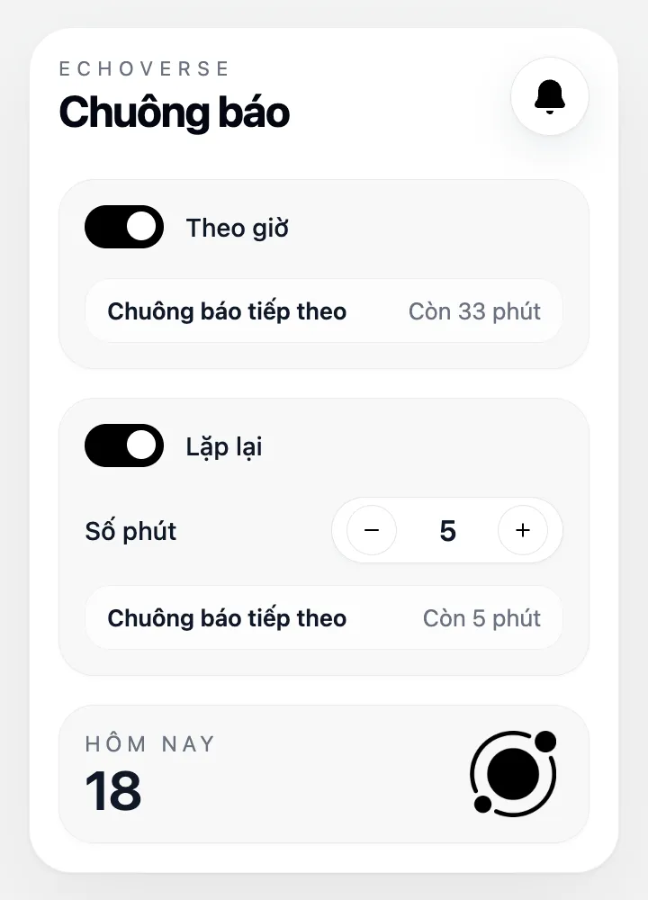
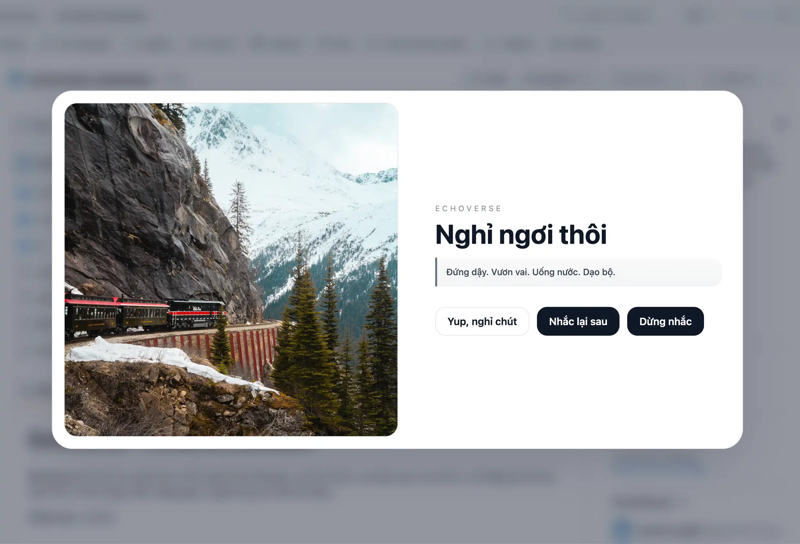

# Echoverse

Echoverse is a Chrome extension for gentle time-based reminders. It helps you stay hydrated, take breaks, and keep a healthier work rhythm with sound alerts, popup controls, and a full-screen overlay.

<table>
  <tr>
    <td style="border: none; vertical-align: middle; text-align: center;"></td>
    <td style="border: none; vertical-align: middle; text-align: center;"></td>
  </tr>
</table>

## Features

- **Hourly reminders**: fire on the next top of the hour, then continue on a fixed hourly cycle. Notification shows the current hour.
- **Recurring reminders**: fire every custom number of minutes from the popup.
- **Full-screen overlay**: show a blocking reminder with `Skip` and `Pause`.
- **Pause by disabling recurring**: pause works by turning off the recurring toggle, not by keeping a separate paused state.
- **Sound toggle**: enable or disable reminder sounds. Hourly uses a bell, recurring uses a beep.
- **Daily stats**: track how many reminders were shown today.
- **Wake-safe rehydration**: clear alarms while the machine is locked and rebuild them when it becomes active again.
- **Popup timer controls**: adjust recurring interval and toggle reminder modes from the popup.

## How it works

- `Hourly` and `Recurring` reminders are stored separately.
- The background service worker rebuilds alarms from persisted state on startup, install, update, and wake.
- When a recurring reminder fires, Echoverse can also show a full-screen overlay in active tabs.
- When the machine locks, Echoverse clears alarms and resets in-memory next-due state to avoid stale countdowns.

## Permissions

- **`notifications`**: show reminder notifications.
- **`storage`**: persist settings, reminder state, and daily stats.
- **`alarms`**: schedule reminders and snooze events.
- **`idle`**: detect lock/active state changes for wake rehydration.
- **`offscreen`**: play reminder sounds.
- **`tabs`**: send overlay messages to open tabs.

## License

MIT. See [LICENSE](LICENSE).
